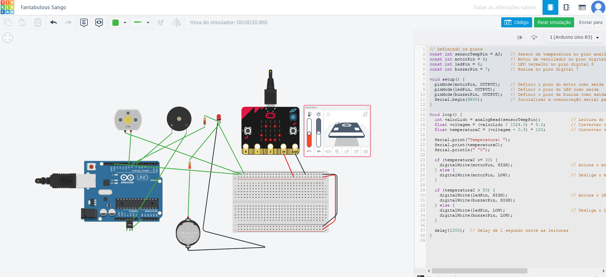
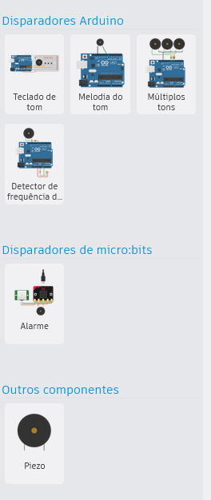
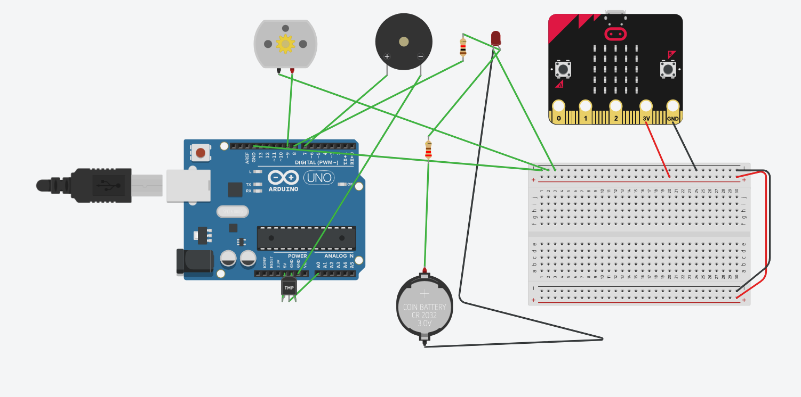
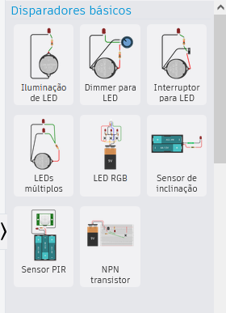
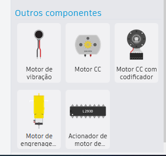
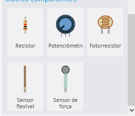

# Projeto de Estufa de Hortaliças com Arduino - TinkerCad

## Objetivo do Desafio

Este projeto simula o controle de uma **estufa de hortaliças** utilizando um **Arduino Uno**, um **sensor de temperatura**, um **motor de ventilação**, um **LED vermelho** e uma **buzina (Piezo)**. O objetivo é monitorar a temperatura dentro da estufa e automatizar o controle da ventilação, além de fornecer alertas visuais e sonoros em situações de emergência.

### Funcionalidades do Projeto

1. **Leitura da Temperatura**: O sensor de temperatura lê a temperatura ambiente.
2. **Controle do Motor de Ventilação**: Quando a temperatura atinge **30°C** ou mais, o motor de ventilação é acionado automaticamente.
3. **Alarme de Emergência**: Se a temperatura ultrapassar **50°C**, o LED vermelho é aceso e a buzina soa, alertando para uma situação crítica.

## Estrutura de Pastas

    Hortalicas_Arduino_TinkerCad/
    │
    ├── backup/                  # Pasta para backups do projeto
    │   ├── backup_01.zip         # Exemplo de arquivo de backup
    │   └── backup_02.zip         # Outro backup
    │
    ├── code/                    # Pasta contendo o código-fonte do Arduino
    │   └── estufa_arduino.ino    # Arquivo do código Arduino (.ino)
    │
    ├── images/                  # Pasta para armazenar as imagens do projeto
    │   ├── circuito.png          # Diagrama do circuito
    │   └── montagem_fisica.png    # Foto/montagem física (se houver)
    │
    ├── docs/                    # Pasta para documentação adicional
    │   └── README.md             # Documento README com informações do projeto
    │
    └── resources/               # Recursos adicionais (opcional)
        ├── links.txt             # Arquivo com links relevantes (ex. simulação no TinkerCad)
        └── referencias.txt       # Possíveis referências de estudos e documentação

### Descrição dos Arquivos e Pastas

- backup/: Contém backups do projeto para manter versões seguras.
- code/: Inclui o arquivo de código estufa_arduino.ino que controla o Arduino.
- images/: Pasta para armazenar diagramas, fotos, e qualquer imagem relacionada ao projeto.
- docs/: O arquivo README.md com todas as instruções e explicações do projeto, conforme o exemplo que forneci.
- resources/: Pode conter links e referências adicionais, caso deseje incluir mais informações úteis para o desenvolvimento do projeto.

## Componentes Utilizados

- **Arduino Uno R3**
- **Sensor de Temperatura TMP36**
- **Motor CC (para simular o ventilador)**
- **LED Vermelho**
- **Buzina (Piezo)**
- **Resistor de 220 ohms** (para o LED)
- **Protoboard**
- **Jumpers para conexões**

## Circuito

O circuito foi montado utilizando o TinkerCad. As principais conexões são:

- O **sensor de temperatura** está conectado ao pino **A0** do Arduino.
- O **motor** está conectado ao pino **9**.
- O **LED vermelho** está conectado ao pino **8** com um resistor de 220 ohms em série.
- A **buzina (Piezo)** está conectada ao pino **7**.
- Os pinos de **GND** e **5V** do Arduino fornecem energia para os componentes.

## Código

O código em C foi desenvolvido para controlar o comportamento descrito acima e está disponível no arquivo [**estufa_arduino.ino**](./estufa_arduino.ino).

    // Definindo os pinos
    const int sensorTempPin = A0;   // Sensor de temperatura no pino analógico A0
    const int motorPin = 9;         // Motor de ventilador no pino digital 9
    const int ledPin = 8;           // LED vermelho no pino digital 8
    const int buzzerPin = 7;        // Buzina no pino digital 7

    void setup() {
    pinMode(motorPin, OUTPUT);    // Definir o pino do motor como saída
    pinMode(ledPin, OUTPUT);      // Definir o pino do LED como saída
    pinMode(buzzerPin, OUTPUT);   // Definir o pino da buzina como saída
    Serial.begin(9600);           // Inicializar a comunicação serial para monitoramento
    }

    void loop() {
    int valorLido = analogRead(sensorTempPin);            // Leitura do sensor de temperatura
    float voltagem = (valorLido / 1024.0) * 5.0;          // Converter o valor lido para voltagem
    float temperaturaC = (voltagem - 0.5) * 100;          // Converter voltagem para temperatura em °C

    Serial.print("Temperatura: ");
    Serial.print(temperaturaC);
    Serial.println(" °C");

    if (temperaturaC >= 30) {
        digitalWrite(motorPin, HIGH);                       // Aciona o motor se a temperatura for >= 30 °C
    } else {
        digitalWrite(motorPin, LOW);                        // Desliga o motor se a temperatura for < 30 °C
    }

    if (temperaturaC > 50) {
        digitalWrite(ledPin, HIGH);                         // Aciona o LED e a buzina se a temperatura for > 50 °C
        digitalWrite(buzzerPin, HIGH);
    } else {
        digitalWrite(ledPin, LOW);                          // Desliga o LED e a buzina se a temperatura for <= 50 °C
        digitalWrite(buzzerPin, LOW);
    }

    delay(1000);  // Delay de 1 segundo entre as leituras
    }

## Imagens do Projeto

## Simulação no TinkerCad

Este projeto foi desenvolvido e testado no ambiente de simulação do TinkerCad. Você pode visualizar e simular o circuito diretamente através do link público do projeto no TinkerCad.

## Como Executar o Projeto

    Clone este repositório ou faça o download dos arquivos.
    Abra o arquivo .ino no Arduino IDE ou use diretamente no TinkerCad.
    Monte o circuito conforme as especificações fornecidas.
    Faça o upload do código para a placa Arduino Uno e monitore a simulação.

## Licença

Este projeto está sob a licença MIT - veja o arquivo LICENSE para mais detalhes.
